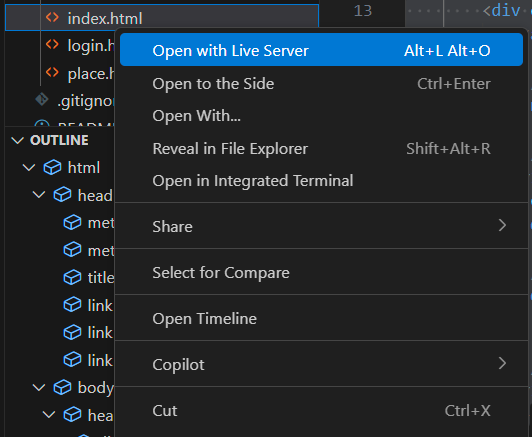
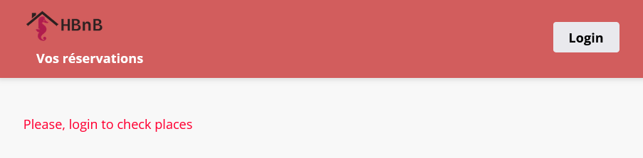
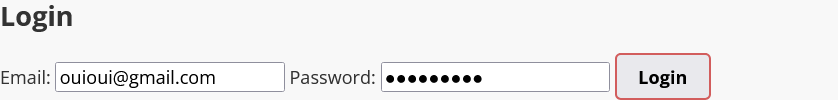
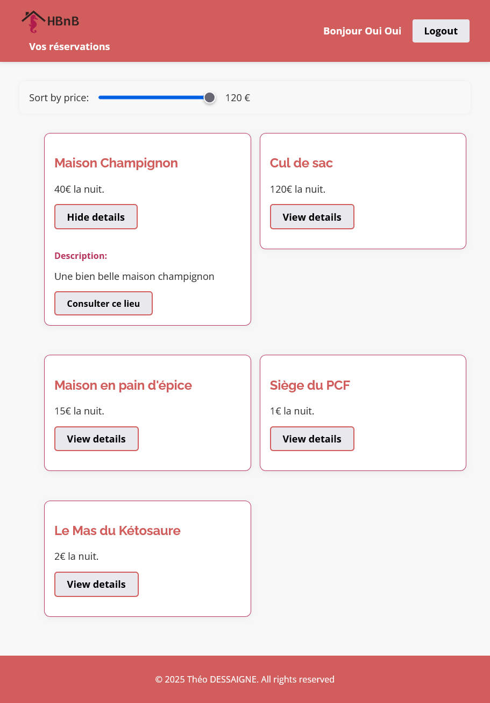
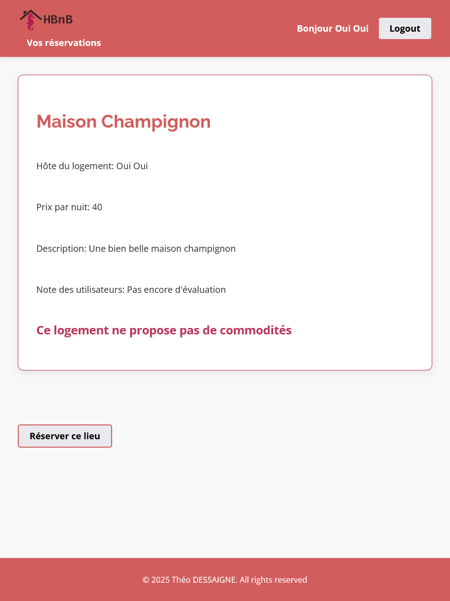
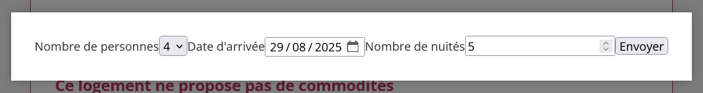
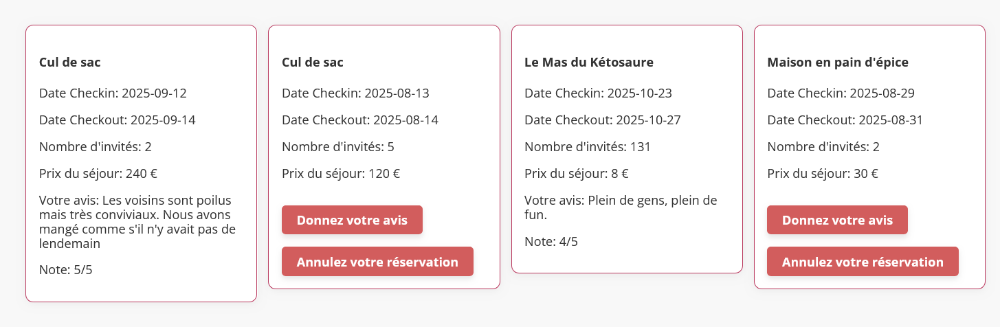
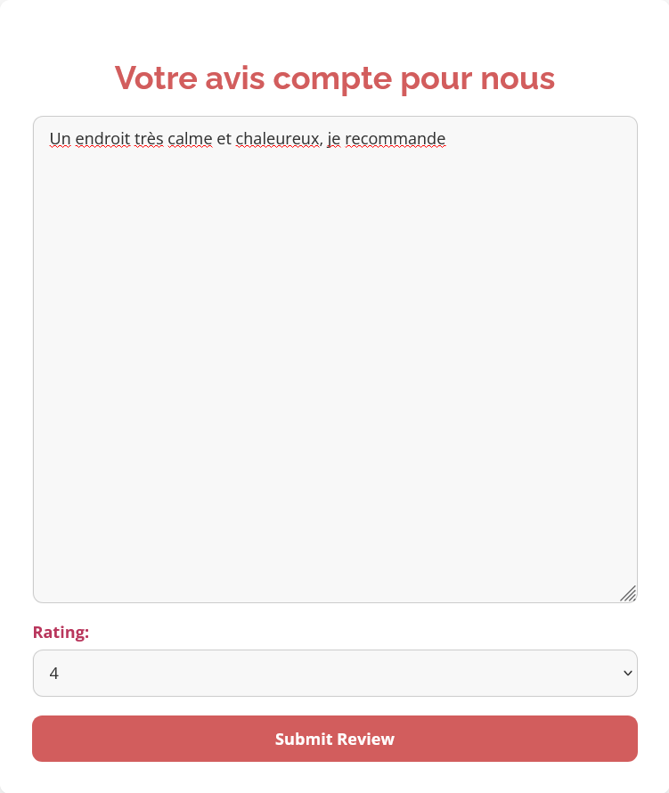

# HBnB Project - Théo DESSAIGNE / Jérôme TRAN

## This repository contains every parts of the Holberton HBnB project


### Presentation

This project concludes the second trimester of our course on web development. The concept, based on AirBnB, aims at reproducing a place-rental website with every base components, such as a database, a back-end using the facade pattern and a dynamic and responsive front-end pulling and sending datas to an API.

### Get Started

First, clone the repository with this command: `git clone https://github.com/Theo-D/holbertonschool-hbnb.git`.

Then from the root of the repository `~/holbertonschool-hbnb$`, set up a virtual environment:
(make sure your python version is up to date).

```bash
~/holbertonschool-hbnb$ python -m venv .hbnb
~/holbertonschool-hbnb$ ./hbnb/bin/activate
~/holbertonschool-hbnb$ pip install -r part3/hbnb/requirements.txt
```
From here you can now run the backend server with `python3 part3/hbnb/run.py`.

Now you can start the front end server (In this exemple, we use the **live server extension** from VS Code on `holbertonschool-hbnb/part4/index.html`).

:bangbang: Be mindful that your backend server should be runing on the port 5000 and your frontend server on the port 5500 alse you might encounter **CORS** errors.

<picture>
 
</picture>

To test the feature you will need to log to an account. Below are 3 accounts already in database that you can use, each with their respective role:

| Role                | Email                  | Password      |
|---------------------|------------------------|---------------|
| admin               | admin@hbnb.io          | admin1234     |
| user                | juanitodu31@outlook.fr | mama!123      |
| host                | ouioui@gmail.com       | potiron34     |

---


### Features

User first needs to login to be able to see places, there's a **login button** on the top right corner just for such a purpose:

<picture>
 
</picture>

---


Once the button is clicked, the user is prompted to enter credentials to be able to use the website, that's where the credentials provided earlier will come in handy. Choose one an login!

<picture>
 
</picture>

---


Once logged in, the user is redirected to the front page now booming with features such as:
- A greeting to the user's name at the left hand side of the now log out button.
- Places cards displaying the available places, their names and their prices.
- The ability to expand places details with a description by the click of a button and giving the ability to access the page of said place.
- A slider to filter places depending on their prices.
- A link at the top left corner to consult one's reservations.

<picture>
 
</picture>

---


Whenever the user clicks on the button to view a place, they are brought to a page where they can see more in depth description of the place, including its amenities, as well as past users reviews on the place.
At the bottom of the page, there's a button to book the place which page the user's on.

<picture>
 
</picture>

---


Clicking the button will make a prompt popup so the user can input the **number of guests**, the **checkin date** and the **number of nights** they wish to stay.

<picture>
 
</picture>

---

Once a booking has been made, they can consult it by click the link on the top left corner. On the following page, that can see their past bookings and their review, and for bookingq with no review, that can either add on or cancel the booking.

<picture>
 
</picture>

---

Whenever they wish to make a review for a given booking, the user should simply write one, and leave a rating :smiley:
<picture>
 
</picture>

---


### Technologies used

#### Backend:
- Python3
- Flask
- Flask-restx
- SQlite3
- SQL Alchemy

#### Frontend:
- Html 5
- CSS 3
- Javascript

#### Security:
- BCrypt
- Werkzeug
- Flask-JWT-Extended
