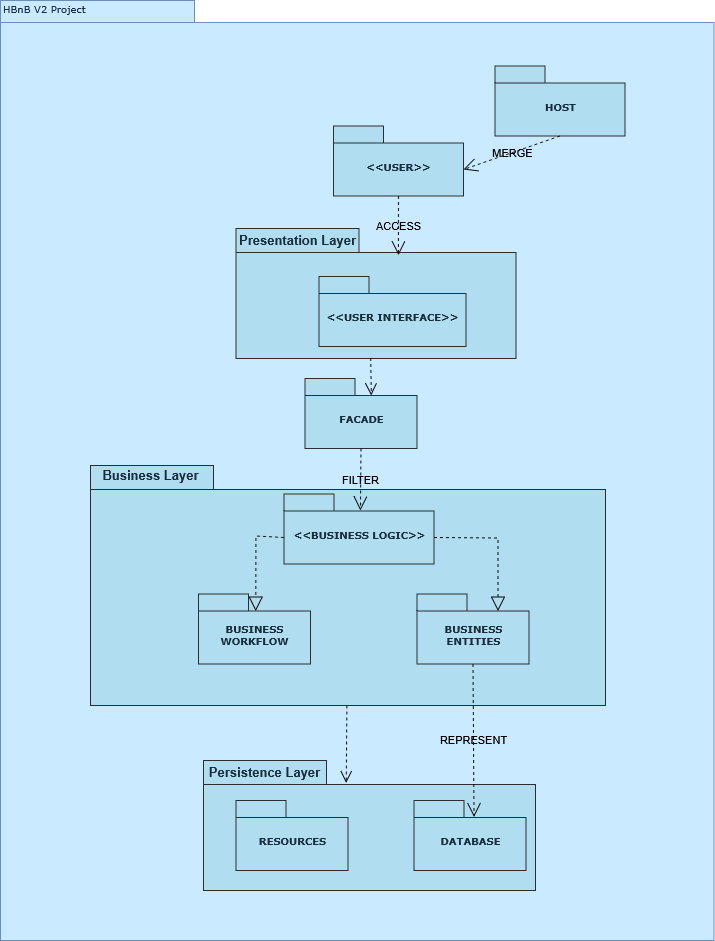
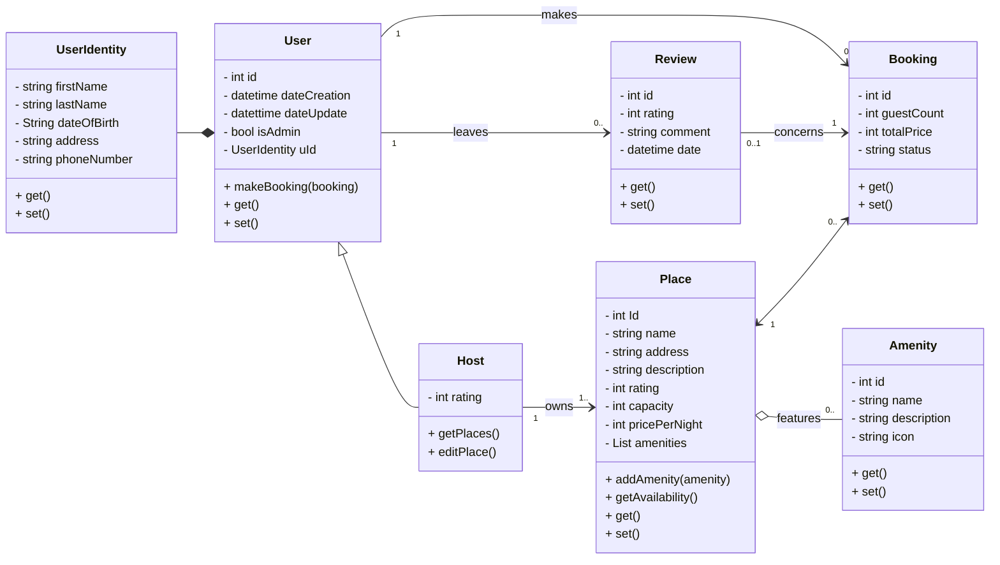

# Holberton - HBnB Project - Part 1 - Project Documention

## Introduction

Welcome to the documentation for our **[HBnB Project]**. This document provides a comprehensive overview of the project's scope.
---

## High-Level Package Diagram

The system follows a layered architecture, ensuring separation of concerns and maintainability. Below is a high-level package diagram illustrating the core structure:

### Layered Architecture

The application is organized into the following layers:

- **Presentation Layer**: Handles user interactions and API requests.
- **Business Logic Layer**: Contains core business rules and logic.
- **Data Access Layer**: Manages persistence and data operations.

### Facade Pattern

To reduce coupling and simplify access between layers, the **Facade Pattern** is employed. It provides a unified interface to a set of interfaces in the subsystem, making the architecture more scalable and testable.

---

## 🧠 Business Logic Layer

### 🧬 Class Diagram

The core business logic is encapsulated in well-defined classes and interfaces, adhering to object-oriented principles. The class diagram below illustrates the main entities and their relationships:

### 📚 Entities Overview

- **EntityA**: Represents [description and role].
- **EntityB**: Handles [functionality and relationships].
- **EntityC**: Coordinates interactions between [entities/subsystems].

These components work together to enforce business rules and ensure domain integrity.

## 🔁 API Interaction Flow

### 📊 Sequence Diagrams

The following sequence diagrams illustrate the flow of selected API calls, demonstrating interactions between components and data movement across the system:

#### 🔍 Example: `GET /items/{id}`

- **Client** sends request to API Gateway.
- **Controller** delegates to the facade.
- **Facade** interacts with business logic and data layer.
- **Response** returned to the client with the item data.

#### ➕ Example: `POST /items`

- **Client** submits item data.
- **Validation** and **transformation** handled in the logic layer.
- **Database** updated, and confirmation returned.

---

## 🧾 Appendix

- All diagrams are located in the `docs/diagrams/` folder.
- For setup instructions, see the [Getting Started Guide](./GETTING_STARTED.md).
